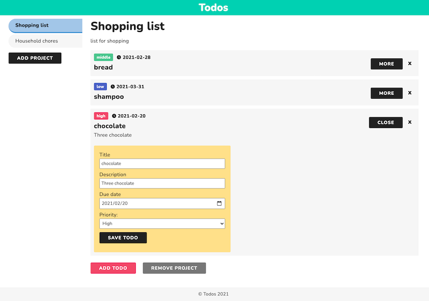

# Todo List

## About the Project

This project is taken from [The Odin Project](https://www.theodinproject.com/courses/javascript/lessons/todo-list).

In this application, Users can:
- Create a to-do list that is saved at the user's local storage
- Arrange todos for different projects
- Create or remove a project and add as many todos as they want to each project
- Edit or remove todos

And We built this application taking care of:
- Organized files and functions based on the MVC concept
- Helper functions to create DOM elements efficiently
- Put a tag to each todo corresponding to its priority with different colors
- Add default data in order to show how to use this app for users

## Table of Contents

* [About the Project](#about-the-project)
* [Built With](#built-with)
* [Live Demo](#live-demo)
* [Getting Started](#getting-started)
* [Authors](#authors)
* [Contributing](#contributing)
* [Show your support](#show-your-support)
* [License](#license)
* [Acknowledgements](#acknowledgements)

## Built With

* [HTML5](https://en.wikipedia.org/wiki/HTML5)
* [SASS(SCSS)](https://sass-lang.com/)
* [JavaScript](https://en.wikipedia.org/wiki/JavaScript)

## Live Demo

[Live Demo Link](https://mv-todo-list.netlify.app/)

## Getting Started

To get a local copy up and running follow these simple example steps.

1. On the project GitHub page, navigate to the main page of the repository.
2. Under the repository name, locate and click on a green button named `Code`.
3. Copy the project URL as displayed.
4. If you're running the Windows Operating System, open your command prompt. On Linux, Open your terminal.
5. Change the current working directory to the location where you want the cloned directory to be made. Leave as it is if the current location is where you want the project to be.
6. Type git clone, and then paste the URL you copied in Step 3.  
e.g. $ git clone https://github.com/Zappat0n/todo_list.git
7. Press Enter. Your local copy will be created.
8. On your console, move to the place where this files are cloned
9. Run `npm run dev`, then server is automatically opened

## Authors

👤 **Yoko Saka**

- GitHub: [@yocosaka](https://github.com/yocosaka)
- Twitter: [@yocosaka](https://twitter.com/yocosaka)
- LinkedIn: [Yoko Saka](https://www.linkedin.com/in/yokosaka)

👤 **Angel Barros**

- GitHub: [@Zappat0n](https://github.com/Zappat0n)
- LinkedIn: [LinkedIn](https://www.linkedin.com/in/angel-barros/)

## Contributing

Contributions, issues, and feature requests are welcome!
Feel free to check the [issues page](../../issues).

1. Fork the Project
2. Create your Feature Branch (`git checkout -b feature/AmazingFeature`)
3. Commit your Changes (`git commit -m 'Add some AmazingFeature'`)
4. Push to the Branch (`git push origin feature/AmazingFeature`)
5. Open a Pull Request

## Show your support

Give a ⭐️ if you like this project!

## License

This project is [MIT](./LICENSE) licensed.

## Acknowledgements
* [Odin Project: Todo List](https://www.theodinproject.com/courses/javascript/lessons/todo-list)
* [uuid](https://github.com/uuidjs/uuid)
* [iconify](https://iconify.design/icon-sets/)
